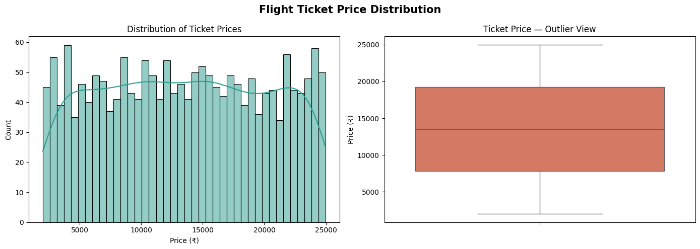
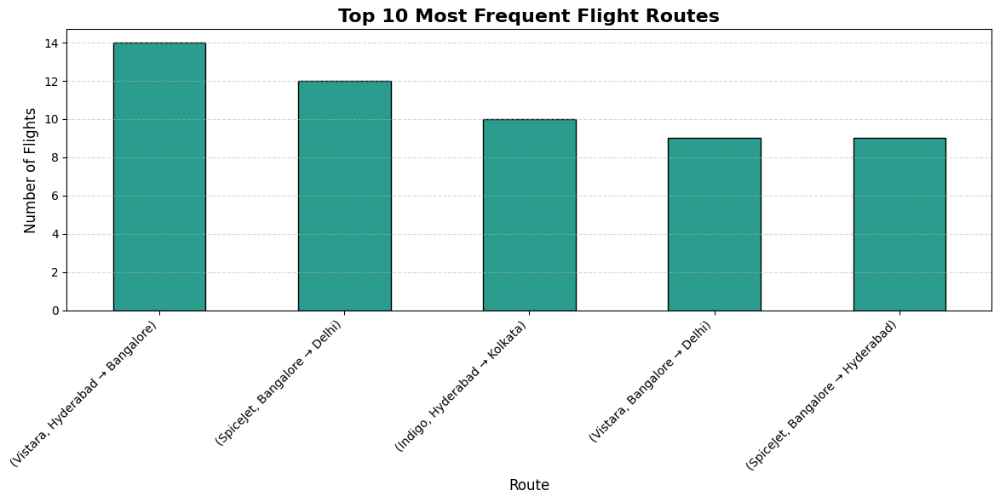
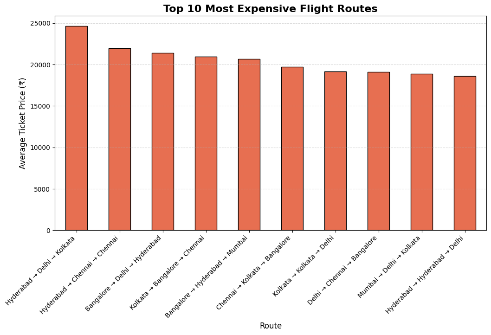
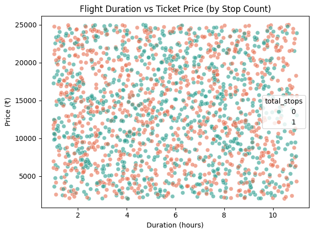
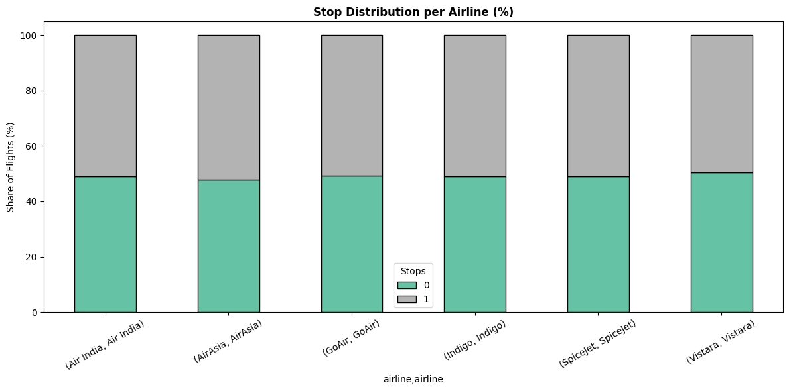
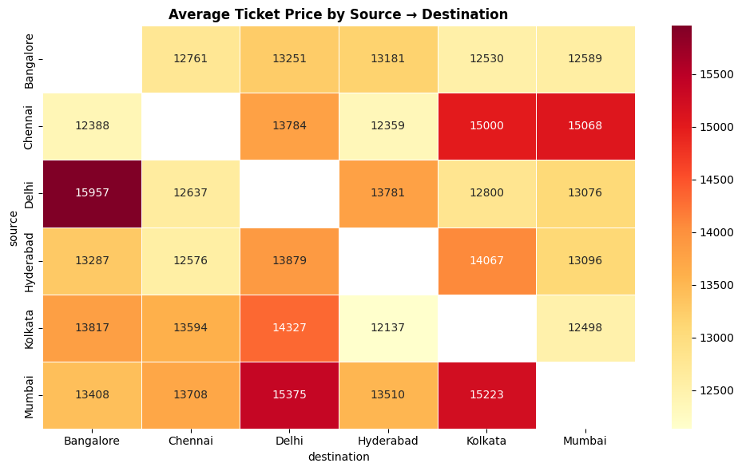
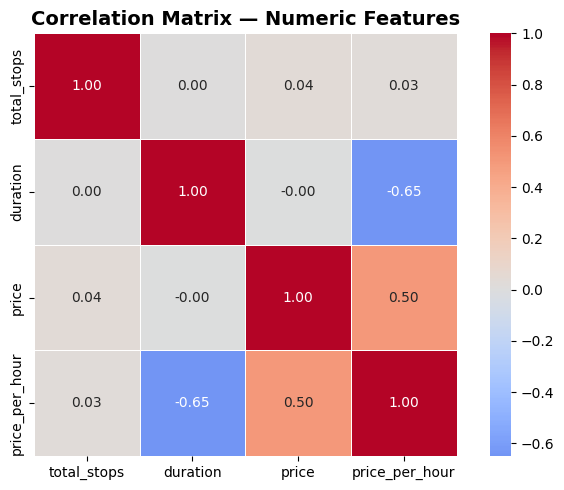

# ✈️ Flight Ticket Price Analysis

End-to-end exploratory data analysis on Indian domestic flight pricing
to identify what actually drives airfare variation across airlines, routes, and cities.

---

## What I found

- Vistara is the priciest airline (median ₹14,805) but the gap between
  airlines is small — route matters more than brand
- One-stop flights cost *more* than direct (₹13,803 vs ₹13,035) —
  stopovers correlate with expensive routes, not convenience pricing
- Duration has near-zero correlation with price (-0.002) — longer flights
  aren't meaningfully more expensive
- Original `total_stops` column had mismatches with actual route data —
  corrected via route-string validation before any analysis was run

---

## Visualizations

### Price Distribution


### Top 10 Most Frequent Routes


### Top 10 Most Expensive Routes


### Flight Duration vs Ticket Price


### Stop Distribution per Airline


### Average Price by Source → Destination


### Correlation Matrix


---

## Stack
Python · Pandas · Seaborn · Matplotlib

## Run locally

```bash
pip install pandas numpy matplotlib seaborn jupyter
jupyter notebook Flight_Ticket_Analysis_EDA.ipynb
```

## Next step
Feature encoding → XGBoost regression → fare prediction pipeline